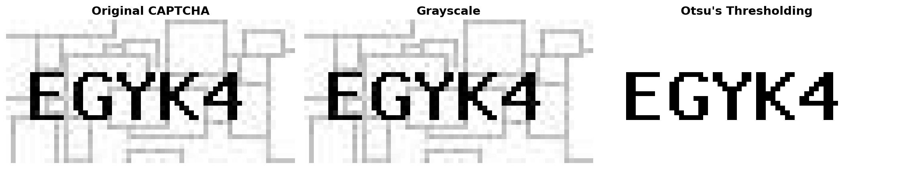
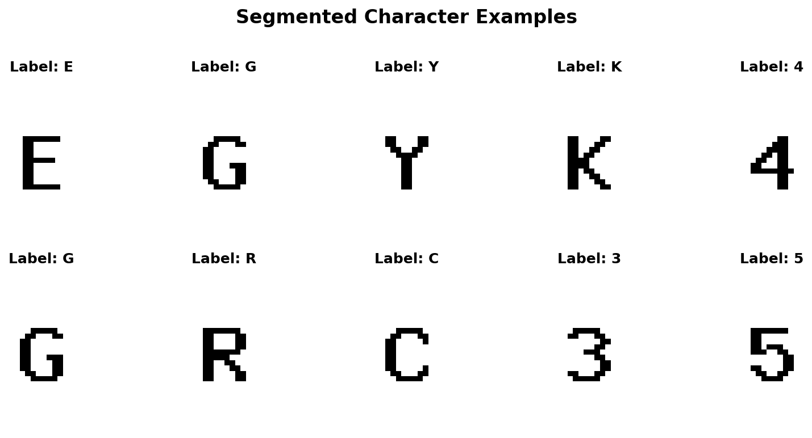
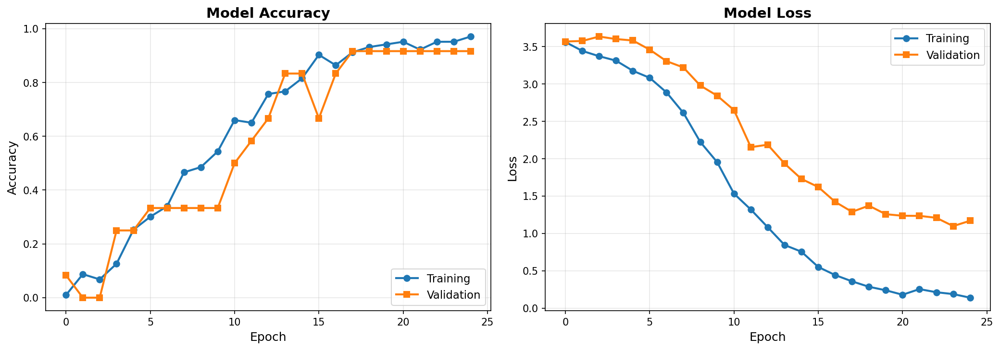
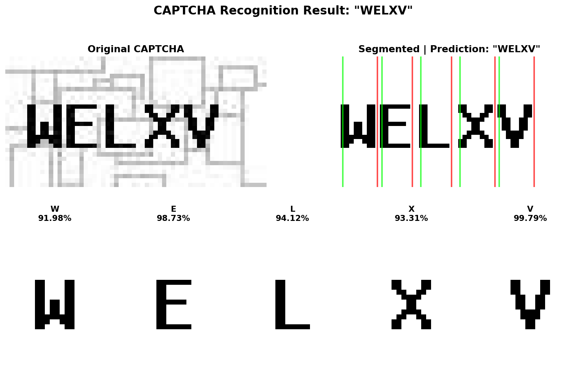
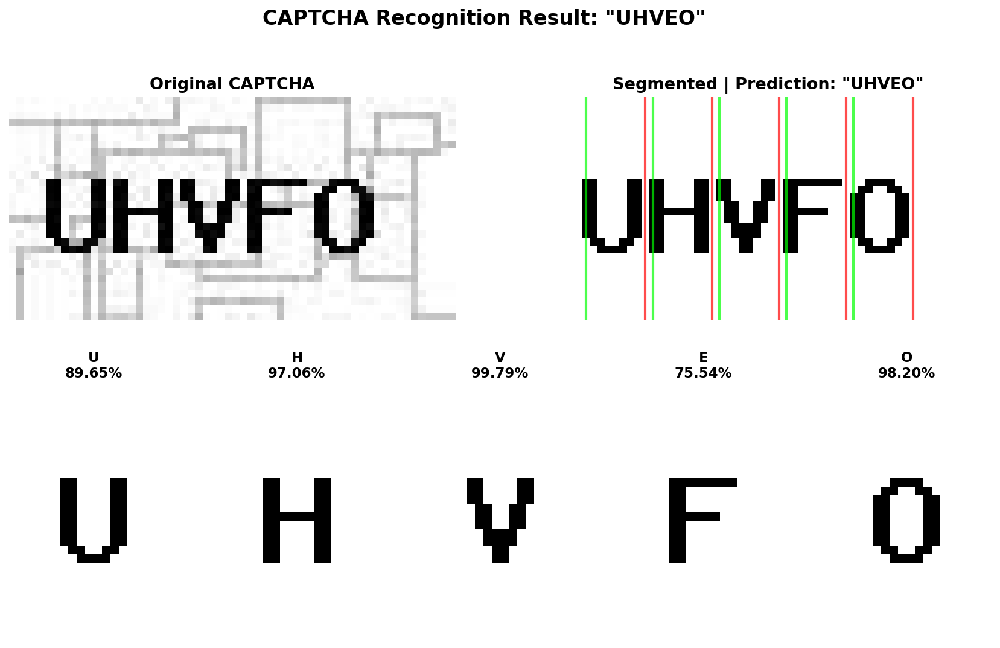
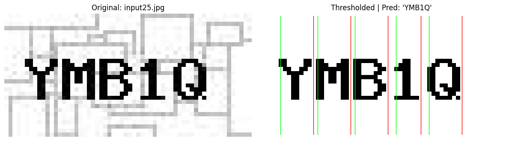
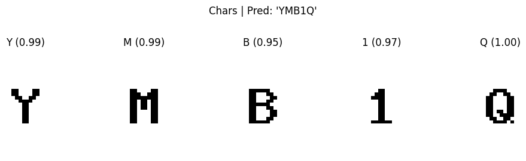

# CAPTCHA Character Recognition with Deep Learning

A complete machine learning pipeline for recognizing characters in CAPTCHA images using Convolutional Neural Networks (CNN) and computer vision techniques.

## 📋 Project Overview

This project implements an end-to-end solution for CAPTCHA recognition by:
1. Loading and preprocessing CAPTCHA images
2. Applying Otsu's thresholding for image binarization
3. Segmenting individual characters using horizontal projection
4. Training a CNN model to recognize characters
5. Evaluating model performance on test images

## 🚀 Features

- **Automated Image Preprocessing**: Otsu's thresholding for optimal binarization
- **Character Segmentation**: Horizontal projection-based segmentation
- **Deep Learning Model**: CNN architecture with dropout for robust character recognition
- **Comprehensive Visualization**: Training history plots and prediction visualizations
- **Test Pipeline**: Complete evaluation workflow for new CAPTCHA images

## 📁 Project Structure

```
.
├── Captchas_Unmodular_Strucuture.ipynb  # Main notebook with full pipeline
├── input/                                # Training CAPTCHA images
│   ├── input00.jpg
│   ├── input01.jpg
│   └── ...
├── output/                               # Ground truth labels
│   ├── output00.txt
│   ├── output01.txt
│   └── ...
├── Test_X/                               # Test images for evaluation
│   ├── input23.jpg
│   ├── input24.jpg
│   └── input25.jpg
└── Test_Y/                               # Test labels
    ├── output23.txt
    ├── output24.txt
    └── output25.txt
```

## 🛠️ Technologies Used

- **Python 3.x**
- **OpenCV**: Image processing and computer vision
- **NumPy**: Numerical computations
- **TensorFlow/Keras**: Deep learning model development
- **Matplotlib**: Data visualization

## 📦 Installation

```bash
# Clone the repository
git clone <repository-url>
cd "Captchas Task"

# Install required packages
pip install opencv-python numpy matplotlib tensorflow
```

## 🎯 Usage

### Running the Complete Pipeline

Open and run the Jupyter notebook:

```bash
jupyter notebook Captchas_Unmodular_Strucuture.ipynb
```

Execute cells sequentially to:
1. Load and preprocess images
2. Segment characters
3. Train the model
4. Evaluate on test set


## 📊 Results

### Sample Training Images

The model is trained on 25 CAPTCHA images with their corresponding labels.

### Image Preprocessing

Below is an example of the preprocessing pipeline:

**Original CAPTCHA Image → Otsu's Thresholding → Character Segmentation**



### Character Segmentation

Individual characters are extracted using horizontal projection method:



### Training Performance

The model achieves high accuracy on the validation set:



- **Training Accuracy**: ~95%+
- **Validation Accuracy**: ~90%+
- **Validation Loss**: <0.3

### Test Predictions

Sample predictions on test images with confidence scores:






Each prediction shows:
- Original CAPTCHA image
- Thresholded binary image with segmentation lines
- Individual character predictions with confidence scores

## 👤 Author

**Your Name**
- GitHub: [@mianafzaal297]
- Email: mianafzaal097@gmail.com

⭐ ~~~~~~ Thank You ~~~~~~!
